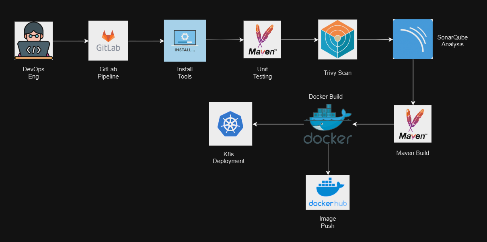

# Implementing CI/CD Pipeline

This repo covers the implementation of both GitLab CI/CD and GitHub Actions CI/CD pipelines. The pipelines are configured with the following tools and technologies:

## Features

- **Maven** for build automation
- **Trivy** for security scanning
- **SonarQube** for code quality analysis
- **Docker** for containerization
- **Kubernetes (K8s)** for deployment
- **Self-hosted Runner** for executing jobs

## Project Architecture

## Documentation

📌 Explore detailed documentation for setting up and configuring both GitLab CI/CD and GitHub Actions CI/CD.

### 🚀 **GitLab CI/CD**  
Guide on implementing GitLab CI/CD.
📖 [Read the GitLab CI/CD Guide](./docs/gitlab-cicd.md)

### ⚡ **GitHub Actions CI/CD**  
Guide on implementing GitHub Actions CI/CD. 
📖 [Read the GitHub Actions CI/CD Guide](./docs/github-actions-cicd.md)

---