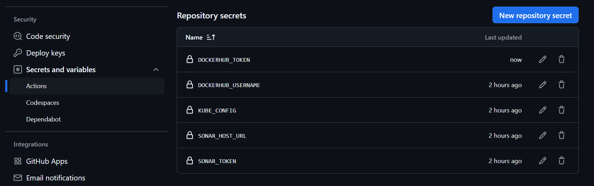

# **Implementing GitHub Actions CI/CD Pipeline**

## **Configure Self-Hosted Runner**

1. Navigate to **GitHub** → **Settings** → **Actions** → **Runners**.
   
   

2. Select **Linux**.
   
   

3. Follow the instructions to set up the runner.
   
   

4. Start the runner and ensure it is idle.
   
   

---

## **Set Up SonarQube**

### **Deploy SonarQube**

1. Run SonarQube in a Docker container:
   ```bash
   docker run -d -p 9000:9000 sonarqube:lts-community
   ```

2. Open SonarQube in your web browser:
   ```
   http://<ip>:9000
   ```

3. Use the default credentials:
   - **Username**: `admin`
   - **Password**: `admin`

---

## **Add SonarQube Secrets in GitHub**

### **1. Generate SonarQube Token**
- Go to **SonarQube** → **Administration** → **Security**.
  
  

- Generate a new token.
  
  

### **2. Add Secrets in GitHub**

- Navigate to **GitHub** → **Settings** → **Secrets and Variables** → **Secrets**.
- Add **Sonar Token**:
  
  

- Add **Sonar Host URL**:
  
  

---

## **Create a KIND Cluster**

### **1. Create the Cluster**

Run the following command:
   ```bash
   kind create cluster --config kind-config.yml
   ```

### **2. KIND Configuration File**
   ```yaml
   kind: Cluster
   apiVersion: kind.x-k8s.io/v1alpha4
   nodes:
     - role: control-plane
       extraPortMappings:
         - containerPort: 30080
           hostPort: 30080
           protocol: TCP
   ```

---

## **Add Kubernetes Config Secret**

1. Get the Kubernetes configuration file as a base64-encoded string:
   ```bash
   base64 ~/.kube/config
   ```
2. Copy and paste this encoded string into GitHub secrets.
   
   

---

## **Add DockerHub Credentials**

- Ensure all required secrets are added to GitHub:
  
  

---

## **Configure GitHub Actions Workflow**

### **Set Up Workflow**

1. Navigate to **GitHub** → **Actions** → **Workflows**.
2. Select **Java With Maven** workflow.
3. Paste the CI/CD pipeline code form:  
    [.github/workflows/github-action-cicd.yml](.github/workflows/github-action-cicd.yml)
4. Save and commit the workflow file.

---

## Verify 

1. Verify k8s deployment


---
2. Open Sonar Status


---
3. Check the Pipeline Status


---